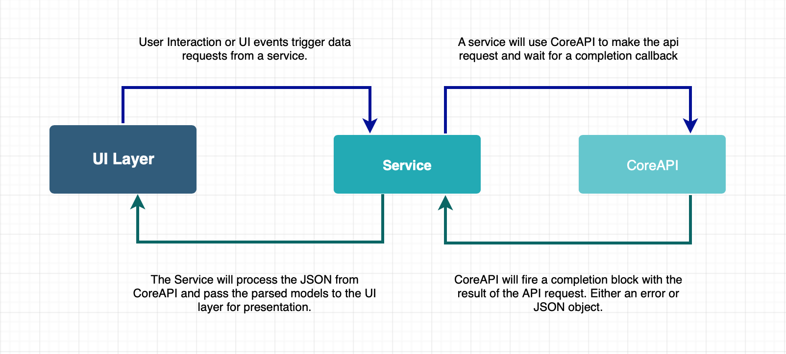

# Project Structure

Area51 uses uses as standard of a structure as possible with a few deviations that should allow contributors to focus on what they want to implement instead of resolving setup issues and merge conflicts.

This project does use Storyboards and Xibs for UI layout!

## .xcodeproj

Most iOS applications commit the main .xcodeproj and use Xcode as the interface for editing the project structure. This is a huge paint when multiple developers are adding, moving, and removing files. It causes merge conflicts which can be difficult to resolve.

Area51 uses [Xcodegen](https://github.com/yonaskolb/XcodeGen) to genereate Area51.xcodeproj which if gitignored. You can at any point delete Area51.xcodeproj and recreate it by running `make generate` from the root directory of the project.

The project settings are defined in the [project.yml](../project.yml) file which xcodegen uses to generate Area51.xcodeproj.

### Targets

In [project.yml](../project.yml) you can see we have several targets defined, such as:

- Area51: The main iOS application target. This is where the UI layer will live. UI layout, user interaction, etc.
- CoreAPI: A static library where we will place core networking code
- ListingService: A static library which will fetch listings from a subreddit and parse them into Listing objects.

## Architecture

For the most part, Area51 is divided into 3 layers:

- UI
- Services
- CoreAPI

### UI

The UI is currently organized in the main Area51 target. It handles user interactions and displaying data. It will use services such as ListingService to fetch data and display it to the user. In the future, there can existing multiple services to seperate the complexity of Reddits API.

### Services

Services are the middle layer between core networking and the UI. Services can use CoreAPI to fetch data from the Reddit API and parse / clean the data so it may be consumed by the UI layer, normally for display to the user.

We could have a service for Subreddits (searching, subscribing, etc.). We can create services for core pieces of the app which make up Reddit as a whole but do not necessarily need to communicate with one another.

### CoreAPI

CoreAPI will handle the https communication between the application and the Reddit API. The main responsibility of CoreAPI is to build and execute the network requests which are requested by different services.

#### Example

You can see how interactions trigger data requests and how data makes it back to the UI by following the code through a few definitions:

- [FeedViewcontroller (Lives in Area51)](../Area51/Sources/FeedViewController.swift)
- [ListingsDatasource (Lives in ListingService)](../ListingService/Sources/ListingsDataSource.swift)
- [CoreAPI (Lives in CoreAPI)](../CoreAPI/Sources/CoreAPI.swift)

##### Responsibilities

- FeedViewcontroller: Glue between ListingsDatasource and UITableViewDataSource / UITableViewDelegate. TableView will ask FeedViewcontroller for cell to display. FeedViewcontroller will instantiate a cell and populate it from data which it recieves from ListingsDatasource.

- ListingsDatasource: Hold the array of listrings for a given subreddit. Communicate with CoreAPI to fetch the JSON data. Parse the JSON data into models which can be passed off to the UI layer.

- CoreAPI: Handle the network requests. Make a given request and return a Result which can be either an error or JSON data.

